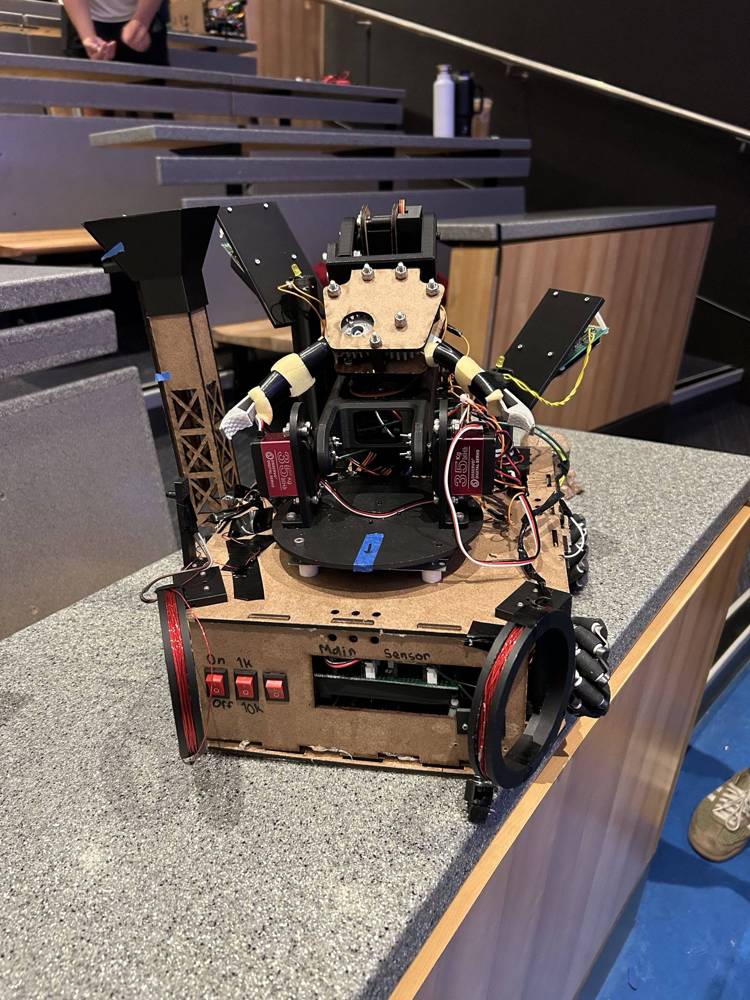
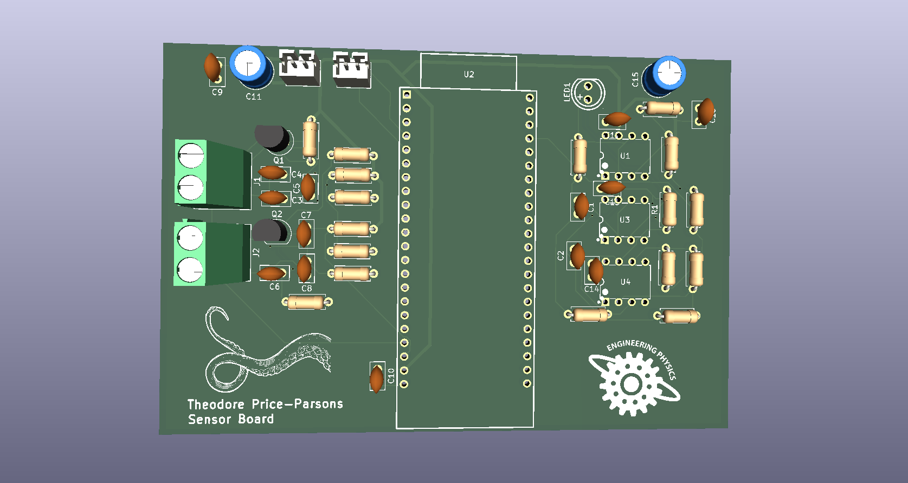
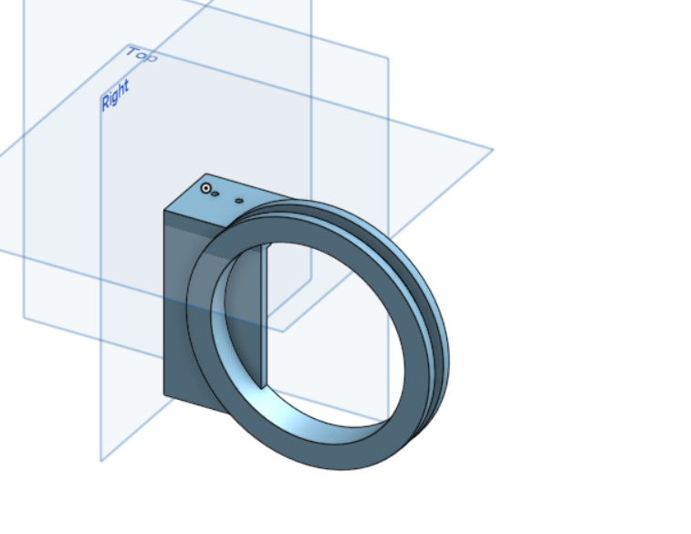
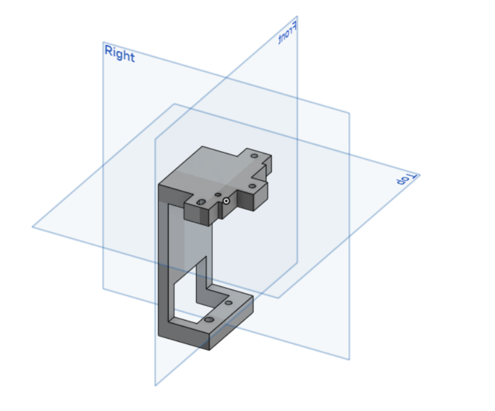
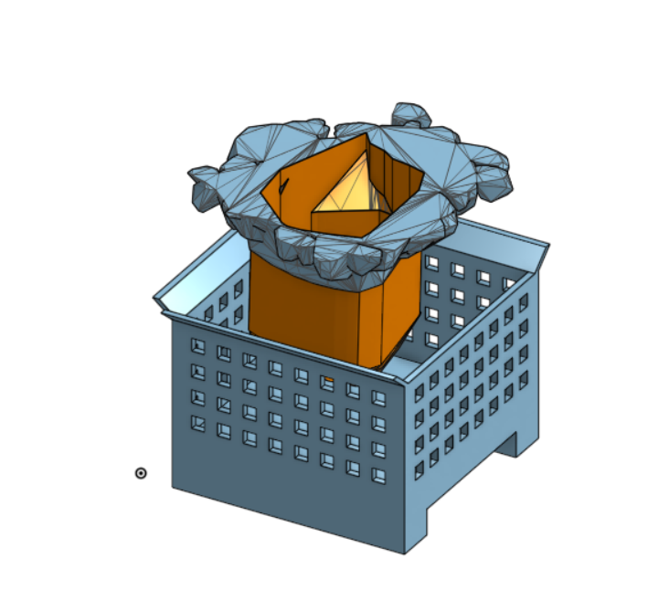

# SENSOR_ESP

Sensor board firmware and PCB for our ENPH 253 (UBC Engineering Physics, summer 2026) competition robot. An ESP32-S3 detects the 1 kHz and 10 kHz IR beacons, measures two metal-detector oscillators to find aluminium in rocks, and streams the results to the main ESP over UART.

<table>
  <tr>
    <td align="center" width="50%"></td>
    <td align="center" width="50%"></td>
  </tr>
  <tr>
    <td align="center"><sub>Mecanum drive base with the gripper arm and one metal-detector coil</sub></td>
    <td align="center"><sub>Front view: both detector coils, power and beacon-select switches</sub></td>
  </tr>
</table>

## Sensor board

<p align="center">
  
</p>

- **IR front end:** QSD124 phototransistor, an op-amp buffer providing a 2.5 V virtual ground, and a non-inverting band-pass stage (gain 4, about 160 Hz to 48 kHz), divided down into the ESP32's ADC range.
- **Metal detectors:** two 2N3904 Colpitts oscillators; the coils connect through screw terminals.
- **Connectors:** 5 V power and UART to the main board on JST-PH.
- **Layout:** metal detectors, ESP32 and IR chain sit in separate areas over a solid bottom ground pour, with bulk and local decoupling on the 5 V rail.
- 2-layer, all through-hole.

## Firmware

### IR beacon detection

The phototransistor signal is sampled at a fixed, hardware-clocked 50 kHz using the ADC continuous (DMA) driver. Samples are grouped into non-overlapping blocks of 500 (10 ms), the mean is removed, and two Goertzel filters measure the amplitude at 1 kHz and 10 kHz. The block size puts both tones on exact DFT bins (k = 10 and k = 100), so neither leaks into neighbouring bins. Each tone has its own threshold, since the analog band-pass does not have flat gain.

### Metal detection

Each detector is a Colpitts LC oscillator (~150 kHz). Metal near the coil shifts its frequency. One PCNT unit per detector counts rising edges in hardware; every 1.5 s the firmware divides the count by the elapsed time measured with `esp_timer`, giving about 0.7 Hz resolution. The main ESP compares against a baseline and decides whether metal is present.

### Build

```sh
idf.py set-target esp32s3
idf.py build flash monitor
```

## Mechanical mounts

<table>
  <tr>
    <td align="center" width="33%"></td>
    <td align="center" width="33%"></td>
    <td align="center" width="33%"></td>
  </tr>
  <tr>
    <td align="center"><sub>Metal detector coil mount</sub></td>
    <td align="center"><sub>Mount bracket</sub></td>
    <td align="center"><sub>Rock basket</sub></td>
  </tr>
</table>
